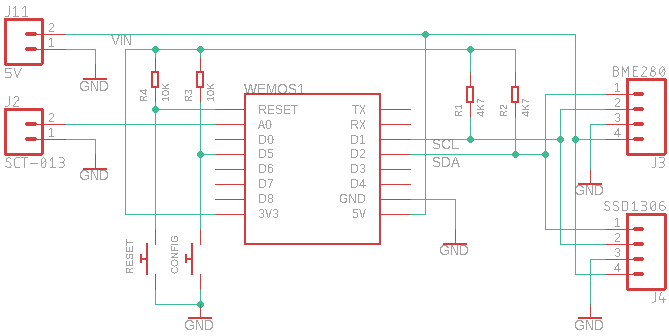

## What is it?

Consumed power metering node with optional environment sensors and LCD display. 
Features network configuration by mobile phone
 
Designed to work with Fusor Hub: [https://github.com/fusor-io/fusor-hub]
   
Tested on `WeMos D1 Mini` (ESP8266)
See [https://www.wemos.cc/en/latest/d1/d1_mini.html]

### Prerequisites:

1. select device in Arduino IDE `LOLIN (WEMOS) D1 R2 & Mini`
2. install libraries:
  - `ArduinoJson` by Benoit Blanchor
  - `Time.h`, see: [https://github.com/PaulStoffregen/Time]. 
     Use Arduino Library Manager, look for `Time by Michael Margolis`.
     It can be found under type: `Contributed`, topic: `Timing`
  - `Fusor State Machine`: [https://github.com/fusor-io/fusor-state-machine]
  - `Fusor State Machine Plugins`: [https://github.com/fusor-io/fusor-state-machine-plugins]
  - `Fusor WiFi Configurator`: [https://github.com/fusor-io/fusor-wifi-configurator]
  - `Fusor Node Connector`: [https://github.com/fusor-io/fusor-node-connector]
  - `U8g2lib` (for LCD)

### How to run?
 
To run this node you need:
- Running `Fusor Hub`
- Uploaded `State Machine Definition` to `Fusor Hub`. 
  Use *postman_collection.json* from this repo (change provided dummy IP address to yours Fusor Hub address)

### Hardware setup

### Known issues with WeMos D1 Mini:

- Failure to initialize FS (SPIFFS). 
  Solution: change board to some other eg. Wemos D1 mini Pro, compile, change back, compile, upload.

